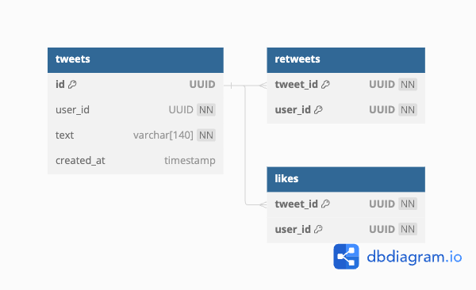

# tweets service

## Database ER diagram



## Build and run Docker containers

```
cp .env.sample .env
make build
make up
```

## Exec the app container and start the service

```
make exec_app
go build ./cmd/tweets
./tweets
```

## Exec the Postgres container

```
make exec_pg
// Start PostgreSQL interactive terminal.
// You can type in queries interactively, issue them to PostgreSQL, and see the query results.
psql
```
